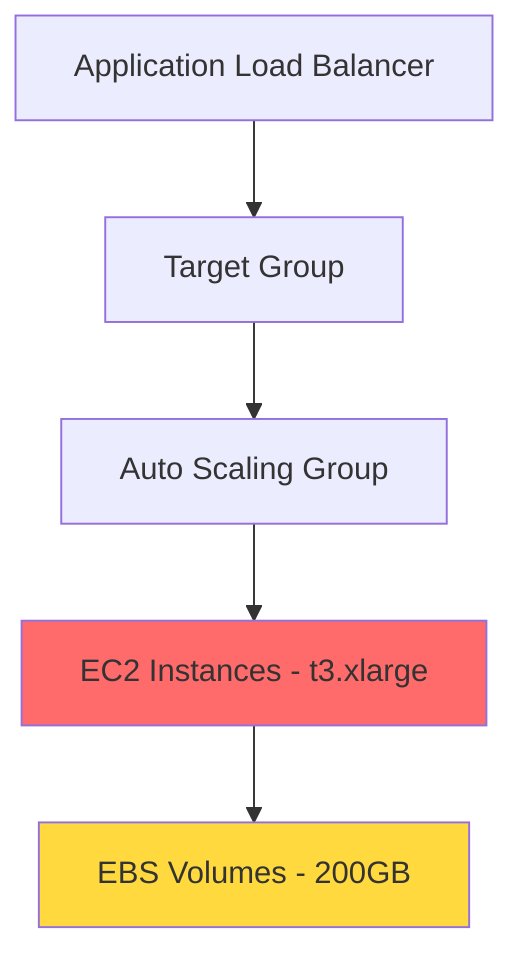

# CostPilot — Predict, Detect & Explain Cloud Cost Regressions Before They Merge

[](https://opensource.org/licenses/MIT)
[](https://www.terraform.io/)
[](https://github.com/Dee66/costpilotdemo)

## 📋 Statement of Purpose

**This repository is the canonical demonstration environment for CostPilot.**

All screenshots, documentation examples, and launch-day assets originate here. This environment is designed to be deterministic, hash-stable, and drift-safe, ensuring reproducible demonstrations of CostPilot's capabilities.

## 🎯 What is CostPilot?

CostPilot prevents cloud cost regressions from reaching production by analyzing infrastructure changes **before they merge**. Using the **Trust Triangle** methodology (Detect → Predict → Explain), CostPilot provides:

- 🔍 **Detection** of cost-impacting changes
- 📊 **Prediction** of cost impact ranges
- 💡 **Explanation** of why costs will change
- 🔧 **Auto-fix suggestions** for common regressions

## 🔺 The Trust Triangle

CostPilot's analysis follows three stages:

### 1. Detect 🔍
Identifies resources with cost implications:
- Resource classification
- Rule IDs and severity scoring
- Cross-service dependency mapping

### 2. Predict 📊
Estimates the cost impact:
- Heuristic-based cost ranges (low/high)
- Cold-start assumptions
- Historical trend analysis

### 3. Explain 💡
Provides actionable insights:
- Root cause analysis
- Regression type classification
- Severity scoring with provenance
- Delta justification

## 🚀 Quick Start

### Prerequisites
- Terraform >= 1.6
- AWS Account
- CostPilot CLI (for snapshot generation)

### Clone the Repository
```bash
git clone https://github.com/Dee66/costpilotdemo.git
cd costpilotdemo
```

### Explore the Infrastructure

**Baseline Stack** (Cost-Efficient):
```bash
cd infrastructure/terraform/baseline
terraform init
terraform plan
```

**PR Change Stack** (With Regressions):
```bash
cd infrastructure/terraform/pr-change
terraform init
terraform plan
```

**Noop Change Stack** (No Cost Impact):
```bash
cd infrastructure/terraform/noop-change
terraform init
terraform plan
```

### View Pre-Generated Snapshots

All CostPilot outputs are pre-generated and frozen in the `snapshots/` directory:

```bash
# Detection results
cat snapshots/detect_v1.json

# Cost predictions
cat snapshots/predict_v1.json

# Explanations
cat snapshots/explain_v1.json

# Auto-fix snippets
cat snapshots/snippet_v1.tf

# Patch preview
cat snapshots/patch_v1.diff
```

## 📖 Sample PR Walkthrough

### Scenario: PR #42 - "Upgrade Instance Types"

A developer opens PR #42 that upgrades EC2 instances from `t3.micro` to `t3.xlarge` for "better performance."

#### Step 1: CostPilot Detects Changes

```json
{
  "detected_changes": [
    {
      "resource": "aws_launch_template.main",
      "attribute": "instance_type",
      "before": "t3.micro",
      "after": "t3.xlarge",
      "severity": "high",
      "rule_id": "EC2_INSTANCE_TYPE_CHANGE"
    },
    {
      "resource": "aws_s3_bucket_lifecycle_configuration.main",
      "change_type": "delete",
      "severity": "high",
      "rule_id": "S3_LIFECYCLE_DISABLED"
    }
  ]
}
```

#### Step 2: CostPilot Predicts Impact

```json
{
  "cost_impact": {
    "monthly_delta": {
      "low": 450.00,
      "high": 720.00,
      "currency": "USD"
    },
    "annual_delta": {
      "low": 5400.00,
      "high": 8640.00,
      "currency": "USD"
    },
    "confidence": "high"
  }
}
```

#### Step 3: CostPilot Explains Why

```json
{
  "explanation": {
    "root_cause": "EC2 instance type upgraded from t3.micro to t3.xlarge",
    "regression_type": "obvious",
    "impact_factors": [
      {
        "resource": "EC2 Instances",
        "factor": "16x vCPU increase (1→16)",
        "cost_multiplier": 16.0
      },
      {
        "resource": "S3 Bucket",
        "factor": "Lifecycle policy disabled",
        "estimated_monthly": 150.00
      }
    ],
    "heuristic_provenance": "AWS Price List API + Historical Usage"
  }
}
```

#### Step 4: Review Auto-Fix Suggestion

```terraform
# CostPilot suggests reverting to cost-efficient instance type
resource "aws_launch_template" "main" {
  instance_type = "t3.micro"  # Revert from t3.xlarge
  
  # Consider t3.small if more capacity is needed
  # Monthly cost: $15.18 vs $121.44 (t3.xlarge)
}
```

## 🗺️ Mapping Example

CostPilot generates dependency maps showing how cost changes propagate:



**Cost Propagation Path:**
1. EC2 instance upgrade → +$600/month
2. EBS volume increase → +$120/month  
3. Total regression → +$720/month

## 📈 Trend Example

CostPilot tracks cost trends over time:


**Trend Types:**
- **Flat Trend**: Costs stable, expected behavior
- **Upward Trend**: Gradual increase, requires attention
- **SLO Breach**: Budget threshold exceeded, immediate action needed

## 🎭 Demo Scenarios

### Baseline Stack
**Purpose**: Cost-efficient baseline for comparison

**Resources**:
- EC2: `t3.micro` instances (cost-optimized)
- Auto Scaling: 2-4 instances
- ALB + Target Group
- S3: Lifecycle policies enabled
- CloudWatch Logs: 30-day retention
- EBS: 20GB volumes

**Monthly Cost**: ~$50

### PR Regression Stack
**Purpose**: Introduces realistic cost regressions

**Obvious Regressions**:
- ❌ EC2: `t3.micro` → `t3.xlarge` (+1500% cost)
- ❌ S3: Lifecycle disabled (no automatic cleanup)

**Subtle Regressions**:
- ⚠️ CloudWatch: 30 days → infinite retention
- ⚠️ EBS: 20GB → 200GB volumes

**Monthly Cost**: ~$770 (+$720 regression)

### Noop Change Stack
**Purpose**: Validates low false-positive rate

**Changes**: Cosmetic only (comments, formatting)  
**Expected CostPilot Output**: ✅ No findings

## 🔧 Patch Preview Scope

CostPilot provides auto-fix suggestions for:

✅ **Supported Resources**:
- EC2 instance types
- S3 lifecycle rules

❌ **Not Supported** (requires broader context):
- Networking changes
- NAT gateway rewrites
- Security group modifications

**Rationale**: Snippet-mode demonstrations require deterministic, isolated changes. Networking modifications often depend on broader infrastructure context not available in patch preview mode.

## 🎬 Scenario Versioning

**Current Version**: `v1.0.0`  
**Scenario ID**: `costpilot.demo.v1`

All snapshots are frozen and version-controlled. If you regenerate outputs, they must match the canonical hashes to prevent drift.

### Deterministic Constraints
- ✅ Hash-stable outputs
- ✅ Float precision: 2 decimal places
- ✅ Whitespace normalized
- ✅ Ordering enforced
- ✅ Layout seeds fixed

## 📊 Repository Structure

```
costpilotdemo/
├── README.md                          # You are here
├── infrastructure/terraform/
│   ├── baseline/                      # Cost-efficient baseline
│   ├── pr-change/                     # Regression scenarios
│   └── noop-change/                   # No-op validation
├── snapshots/                         # Frozen CostPilot outputs
│   ├── detect_v1.json
│   ├── predict_v1.json
│   ├── explain_v1.json
│   ├── snippet_v1.tf
│   └── patch_v1.diff
├── .costpilot/demo/                   # Demo-specific outputs
├── costpilot_artifacts/               # Dynamic outputs
├── tools/                             # Utility scripts
│   ├── reset_demo.sh                  # Reset to baseline
│   └── update_progress.py             # Progress tracker
└── docs/                              # Specifications
    ├── products.yml                   # Product spec
    └── checklist.yml                  # Implementation checklist
```

## 🛠️ Development

### Reset Demo Environment

```bash
./tools/reset_demo.sh
```

This script:
- Restores baseline infrastructure
- Regenerates all snapshots
- Validates deterministic hashes
- Fails if drift is detected

### Track Implementation Progress

```bash
python3 tools/update_progress.py
```

View `checklist.md` for detailed progress tracking.

## 🚫 What This Demo Does NOT Include

To keep the demo lightweight and public-safe:

- ❌ Enterprise features
- ❌ Enterprise policies
- ❌ Exemptions workflow
- ❌ SLO burn reports
- ❌ Team attribution

This is an MVP-aligned demonstration environment.

## 📄 License

MIT License - Safe for public tutorials, demos, and launch content.

## 🎯 Performance Expectations

- **Detect**: < 200ms
- **Predict**: < 300ms
- **Explain**: < 300ms

## 🔗 Resources

- **Documentation**: [docs/products.yml](docs/products.yml)
- **Checklist**: [checklist.md](checklist.md)
- **Progress**: Run `python3 tools/update_progress.py`

---

**Built with ❤️ for the CostPilot launch**  
*Last Updated: 2025-12-06*
