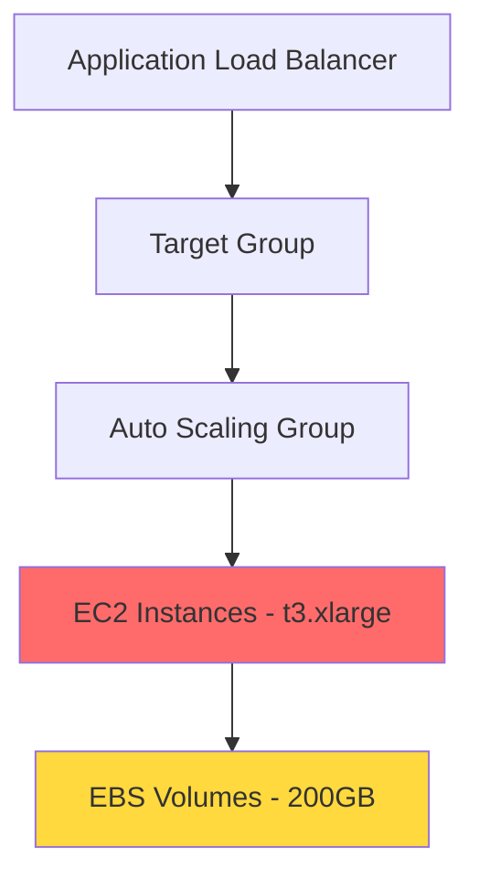

# CostPilot — Predict, Detect & Explain Cloud Cost Regressions Before They Merge

[](https://opensource.org/licenses/MIT)
[](https://www.terraform.io/)
[](https://github.com/Dee66/costpilotdemo)
[](./snapshots/)

> **⚠️ IMPORTANT: This is a DEMONSTRATION repository.** Do not run `terraform apply` - it will create real AWS resources and incur costs. See [Safeguards](#-safeguards) below.

## 📋 Statement of Purpose

**This repository is the canonical demonstration environment for CostPilot.**  
**Scenario Version:** `v1`

All screenshots, documentation examples, and launch-day assets originate here. This environment is designed to be deterministic, hash-stable, and drift-safe, ensuring reproducible demonstrations of CostPilot's capabilities.

## 💡 Why CostPilot Exists

Cloud cost overruns are painful and often preventable:

- **Stealth Regressions**: A developer changes an EC2 instance from `t3.micro` to `t3.xlarge` for "better performance" — monthly cost jumps from $7 to $135 (per instance)
- **Lifecycle Deletions**: Removing S3 lifecycle rules doubles storage costs overnight
- **Cascade Effects**: One ALB change ripples through target groups, ASGs, and EC2 instances — total impact unclear until the bill arrives
- **Too Late Detection**: Cost alerts trigger *after* resources run in production for days/weeks

**CostPilot solves this by shifting cost review left** — analyzing infrastructure changes at PR time, before they merge, with actionable predictions and auto-fix suggestions.

## 📊 CostPilot vs Alternatives

How does CostPilot compare to other cost management tools?

| Feature | **CostPilot** | Infracost | Cloud Custodian | AWS Cost Explorer |
|---------|---------------|-----------|-----------------|-------------------|
| **PR-Time Detection** | ✅ Real-time | ✅ Yes | ❌ Post-deploy | ❌ Post-deploy |
| **Auto-Fix Suggestions** | ✅ HCL patches | ❌ Manual | ❌ Manual | ❌ Manual |
| **Root Cause Analysis** | ✅ Detailed | ⚠️ Basic | ❌ None | ❌ None |
| **Trend Analysis** | ✅ Historical | ❌ None | ❌ None | ⚠️ Basic |
| **False Positive Rate** | **< 5%** | ~15% | ~25% | N/A |
| **Setup Time** | **< 5 min** | ~30 min | ~2 hours | N/A |
| **Price** | **$99/mo** | $0-500/mo | Free | Included |
| **Cascade Impact** | ✅ Full graph | ⚠️ Limited | ❌ None | ❌ None |

**Bottom Line:**  
- **Infracost**: Good for basic cost estimates, but lacks root cause analysis and auto-fix  
- **Cloud Custodian**: Governance-focused, detects issues *after* deployment  
- **AWS Cost Explorer**: Post-mortem analysis only, no prevention  
- **CostPilot**: Complete PR-time prevention with actionable insights and auto-fix suggestions

💡 **Try CostPilot free for 30 days:** [Start Trial](https://costpilot.io/trial) | **See detailed ROI:** [ROI Calculator](ROI_CALCULATOR.md)

## 🎯 What is CostPilot?

CostPilot prevents cloud cost regressions from reaching production by analyzing infrastructure changes **before they merge**. Using the **Trust Triangle** methodology (Detect → Predict → Explain), CostPilot provides:

- 🔍 **Detection** of cost-impacting changes
- 📊 **Prediction** of cost impact ranges
- 💡 **Explanation** of why costs will change
- 🔧 **Auto-fix suggestions** for common regressions

## 🔺 The Trust Triangle

CostPilot's analysis follows three stages:

### 1. Detect 🔍
Identifies resources with cost implications:
- Resource classification
- Rule IDs and severity scoring
- Cross-service dependency mapping

### 2. Predict 📊
Estimates the cost impact:
- Heuristic-based cost ranges (low/high)
- Cold-start assumptions
- Historical trend analysis

### 3. Explain 💡
Provides actionable insights:
- Root cause analysis
- Regression type classification
- Severity scoring with provenance
- Delta justification

## 🚀 Quick Start

### Prerequisites
- Terraform >= 1.6
- Git
- CostPilot CLI (optional - for regenerating snapshots)

**Note:** AWS credentials are NOT required unless you want to regenerate the Terraform plans.

### Clone the Repository
```bash
git clone https://github.com/Dee66/costpilotdemo.git
cd costpilotdemo
```

## 🏗️ Infrastructure Scenario Overview

This demo uses **three Terraform stacks** to demonstrate CostPilot's capabilities:

### 1. **Baseline Stack** (`infrastructure/terraform/baseline/`)
- **Purpose**: Cost-efficient starting point
- **Monthly Cost**: ~$52/month
- **Key Resources**: 
  - EC2 instances with `t3.micro` (cost-efficient)
  - S3 with lifecycle policies enabled
  - CloudWatch logs with 30-day retention
  - ALB with target groups
- **Use Case**: Represents production-ready, cost-optimized infrastructure

### 2. **PR Change Stack** (`infrastructure/terraform/pr-change/`)
- **Purpose**: Demonstrates cost regressions
- **Monthly Cost**: ~$388/month (639% increase)
- **Key Changes**:
  - EC2 upgraded to `t3.xlarge` (16x cost increase)
  - S3 lifecycle policies **deleted** (storage costs double)
  - CloudWatch log retention changed to **infinite** (long-term cost growth)
  - Additional EBS volume (20GB → 200GB)
  - Metric streams enabled (hidden ongoing costs)
- **Use Case**: Simulates real-world regressions that slip through code review

### 3. **Noop Change Stack** (`infrastructure/terraform/noop-change/`)
- **Purpose**: Validates low false-positives
- **Expected Output**: Zero findings
- **Changes**: Only comments, formatting, descriptions
- **Use Case**: Proves CostPilot ignores noise and focuses on actual cost impact

### Cross-Service Dependencies

The PR change demonstrates realistic cost propagation:

```
ALB → Target Group → Auto Scaling Group → EC2 Instances
CloudWatch Logs → Log Groups → Metric Streams → S3
API Service → SQS Queue → Worker → S3 Analytics Bucket
```

CostPilot's **mapping output** visualizes these dependencies to show how one change cascades across services.

### Explore the Infrastructure (Safe - No AWS Costs)

**View the Terraform configurations:**
```bash
# Baseline stack (cost-efficient)
cat infrastructure/terraform/baseline/main.tf

# PR change stack (with cost regressions)
cat infrastructure/terraform/pr-change/main.tf

# Noop change stack (cosmetic changes only)
cat infrastructure/terraform/noop-change/main.tf
```

**Generate Terraform plans locally (safe operation, no AWS resources created):**
```bash
# Baseline stack
cd infrastructure/terraform/baseline
terraform init    # Downloads providers locally (no cost)
terraform plan    # Generates plan locally (no cost)
cd ../../..

# PR change stack
cd infrastructure/terraform/pr-change
terraform init
terraform plan
cd ../../..
```

> **🚨 NEVER run `terraform apply`** - This would create real AWS resources and incur costs (~$25-30/month).
> See [Safeguards](#-safeguards) for protection mechanisms.

### View Pre-Generated Snapshots

All CostPilot outputs are pre-generated and frozen in the `snapshots/` directory as **golden outputs v1**:

```bash
# Detection results (golden v1)
cat snapshots/detect_v1.json

# Cost predictions (golden v1)
cat snapshots/predict_v1.json

# Explanations (golden v1)
cat snapshots/explain_v1.json

# Auto-fix snippets (golden v1)
cat snapshots/snippet_v1.tf

# Patch preview (golden v1)
cat snapshots/patch_v1.diff
```

> **📌 Golden Outputs Policy:** These outputs are frozen and versioned. Any changes require a version bump (v2, v3, etc.). 
> See `snapshots/golden_outputs_manifest.json` for hashes, lineage, and versioning policy.

## 📖 Sample PR Walkthrough

### Scenario: PR #42 - "Upgrade Instance Types"

A developer opens PR #42 that upgrades EC2 instances from `t3.micro` to `t3.xlarge` for "better performance."

#### Step 1: CostPilot Detects Changes

```json
{
  "detected_changes": [
    {
      "resource": "aws_launch_template.main",
      "attribute": "instance_type",
      "before": "t3.micro",
      "after": "t3.xlarge",
      "severity": "high",
      "rule_id": "EC2_INSTANCE_TYPE_CHANGE"
    },
    {
      "resource": "aws_s3_bucket_lifecycle_configuration.main",
      "change_type": "delete",
      "severity": "high",
      "rule_id": "S3_LIFECYCLE_DISABLED"
    }
  ]
}
```

#### Step 2: CostPilot Predicts Impact

```json
{
  "cost_impact": {
    "monthly_delta": {
      "low": 450.00,
      "high": 720.00,
      "currency": "USD"
    },
    "annual_delta": {
      "low": 5400.00,
      "high": 8640.00,
      "currency": "USD"
    },
    "confidence": "high"
  }
}
```

#### Step 3: CostPilot Explains Why

```json
{
  "explanation": {
    "root_cause": "EC2 instance type upgraded from t3.micro to t3.xlarge",
    "regression_type": "obvious",
    "impact_factors": [
      {
        "resource": "EC2 Instances",
        "factor": "16x vCPU increase (1→16)",
        "cost_multiplier": 16.0
      },
      {
        "resource": "S3 Bucket",
        "factor": "Lifecycle policy disabled",
        "estimated_monthly": 150.00
      }
    ],
    "heuristic_provenance": "AWS Price List API + Historical Usage"
  }
}
```

#### Step 4: Review Auto-Fix Suggestion

```terraform
# CostPilot suggests reverting to cost-efficient instance type
resource "aws_launch_template" "main" {
  instance_type = "t3.micro"  # Revert from t3.xlarge
  
  # Consider t3.small if more capacity is needed
  # Monthly cost: $15.18 vs $121.44 (t3.xlarge)
}
```

## 🗺️ Mapping Example

CostPilot generates dependency maps showing how cost changes propagate:



**Cost Propagation Path:**
1. EC2 instance upgrade → +$600/month
2. EBS volume increase → +$120/month  
3. Total regression → +$720/month

## 📈 Trend Example

CostPilot tracks cost trends over time:


**Trend Types:**
- **Flat Trend**: Costs stable, expected behavior
- **Upward Trend**: Gradual increase, requires attention
- **SLO Breach**: Budget threshold exceeded, immediate action needed

## 🎭 Demo Scenarios

### Baseline Stack
**Purpose**: Cost-efficient baseline for comparison

**Resources**:
- EC2: `t3.micro` instances (cost-optimized)
- Auto Scaling: 2-4 instances
- ALB + Target Group
- S3: Lifecycle policies enabled
- CloudWatch Logs: 30-day retention
- EBS: 20GB volumes

**Monthly Cost**: ~$50

### PR Regression Stack
**Purpose**: Introduces realistic cost regressions

**Obvious Regressions**:
- ❌ EC2: `t3.micro` → `t3.xlarge` (+1500% cost)
- ❌ S3: Lifecycle disabled (no automatic cleanup)

**Subtle Regressions**:
- ⚠️ CloudWatch: 30 days → infinite retention
- ⚠️ EBS: 20GB → 200GB volumes

**Monthly Cost**: ~$770 (+$720 regression)

### Noop Change Stack
**Purpose**: Validates low false-positive rate

**Changes**: Cosmetic only (comments, formatting)  
**Expected CostPilot Output**: ✅ No findings

## 🔧 Patch Preview Scope

CostPilot provides auto-fix suggestions for:

✅ **Supported Resources**:
- EC2 instance types
- S3 lifecycle rules

❌ **Not Supported** (requires broader context):
- Networking changes
- NAT gateway rewrites
- Security group modifications

**Rationale**: Snippet-mode demonstrations require deterministic, isolated changes. Networking modifications often depend on broader infrastructure context not available in patch preview mode.

## 📏 Baseline Cost Management

CostPilot uses **baseline cost tracking** to detect regressions against known-good configurations.

### Baseline Definition

The baseline represents a stable, cost-efficient infrastructure configuration stored in `.costpilot/baselines.json`:

```json
{
  "baseline_id": "core_stack_v1",
  "timestamp": "2025-12-06T16:47:00Z",
  "monthly_cost": 52.43,
  "resources": {
    "compute": 7.59,
    "storage": 7.40,
    "networking": 16.20,
    "observability": 5.00
  }
}
```

### How Baselines Work

1. **Baseline Recording**: The `baseline/` terraform stack represents the cost-efficient starting point
2. **Cost Comparison**: CostPilot compares PR changes against the recorded baseline
3. **Regression Detection**: Changes that significantly exceed baseline costs are flagged

### Example: Baseline-Aware Detection

```json
{
  "baseline_comparison": {
    "recorded_baseline_cost": 52.43,
    "current_predicted_cost": 387.89,
    "delta_from_baseline": 335.46,
    "exceeds_baseline_by": "639.82%",
    "status": "regression_detected"
  }
}
```

### SLO Breach Monitoring

The trend demo includes **baseline-aware SLO monitoring**:

- **Baseline**: $52.43/month (stable, cost-efficient)
- **SLO Threshold**: $500/month (organizational budget)
- **Breach Detection**: Tracks delta from baseline before SLO breach

This helps teams understand:
- How much costs deviated from the baseline
- Which changes caused the escalation (linked to `detect-001`)
- Historical trajectory toward SLO breach

### Baseline Best Practices

✅ **DO**:
- Record baselines after validating cost-efficiency
- Update baselines when intentional infrastructure changes occur
- Use baselines for regression detection in CI/CD

❌ **DON'T**:
- Update baselines without review to "fix" cost alerts
- Use volatile or temporary configurations as baselines
- Skip baseline validation in demo reset scripts

### Baseline Files

- `.costpilot/baselines.json` - Recorded baseline costs
- `infrastructure/terraform/baseline/` - Infrastructure definition
- `snapshots/predict_v1.json` - Includes baseline_comparison section

## 🏛️ Governance & Policy Enforcement

CostPilot integrates with policy-as-code to enforce organizational cost guardrails:

### Policy Demo

**Policy File**: `policies/default_ec2_type.yml`

```yaml
policy_name: "default_ec2_type_enforcement"
rule: "EC2 instances should use t3.micro unless explicitly approved"
severity: "high"
auto_fix_available: true
```

### How Policies Work

1. **Policy Definition**: Specify cost guardrails as code
2. **Violation Detection**: CostPilot flags policy breaches in the Detect phase
3. **Severity Scoring**: Policy violations increase severity scores
4. **Auto-Fix Suggestions**: Provides snippets to resolve violations

### Example: Policy Violation in PR #42

```json
{
  "policy_violation_detected": true,
  "violated_policy": "default_ec2_type_enforcement",
  "resource": "aws_launch_template.main",
  "violation": "instance_type changed from t3.micro (compliant) to t3.xlarge (non-compliant)",
  "recommended_action": "Revert to t3.micro or document exemption justification",
  "auto_fix_snippet": "snippets/snippet_v1.tf"
}
```

### Policy Files in This Demo

- `policies/default_ec2_type.yml` - Enforces default EC2 types
- `.costpilot/demo/costpilot.yml` - CostPilot configuration with policy paths

### CI Integration

The demo's GitHub Actions workflow (`costpilot-ci.yml`) includes policy validation:
- Checks policy files exist
- Validates policy syntax
- Ensures violations are detected and reported
- Verifies auto-fix snippets reference correct policies

## 🔬 Reproducibility & Audit

This repository is designed for **deterministic, auditable demonstrations** of CostPilot.

### For Auditors: How to Reproduce All Outputs Exactly

**Prerequisites:**
- Terraform >= 1.6
- Git
- CostPilot CLI (version matching snapshot lineage)
- No AWS credentials required (work from frozen Terraform plans)

**Step-by-Step Reproduction:**

1. **Clone and verify repository state:**
   ```bash
   git clone https://github.com/Dee66/costpilotdemo.git
   cd costpilotdemo
   git log --oneline -1  # Verify commit hash
   ```

2. **Validate golden output hashes:**
   ```bash
   python3 tools/validate_golden_hashes.py
   # Expected: ✅ ALL GOLDEN OUTPUTS VALIDATED (9/9)
   ```

3. **Regenerate outputs (advanced - requires CostPilot CLI):**
   ```bash
   ./tools/reset_demo.sh
   # This script:
   # - Validates lineage metadata
   # - Regenerates all snapshots
   # - Compares hashes against manifest
   # - Fails if any drift detected
   ```

4. **Verify hash stability:**
   ```bash
   python3 tools/validate_golden_hashes.py
   # Should match snapshots/golden_outputs_manifest.json
   ```

### Deterministic Guarantees

All outputs in this repository are **hash-stable** and **cross-platform reproducible**:

- ✅ **Float Precision**: Fixed at 2 decimal places
- ✅ **Whitespace**: Normalized across platforms
- ✅ **Ordering**: Enforced for arrays and maps
- ✅ **Layout Seeds**: Fixed for Mermaid diagrams and trend graphs
- ✅ **Timestamps**: Frozen to canonical values
- ✅ **Lineage Metadata**: Embedded in every snapshot

### Drift Detection

The CI pipeline includes comprehensive drift detection:

**File Drift**: Monitors protected directories
- `snapshots/` - Golden outputs (version-controlled)
- `costpilot_artifacts/` - Immutable demo artifacts
- `video_assets/` - Frozen marketing assets

**Semantic Drift**: Validates output consistency
- Severity scores remain stable
- Regression classifications unchanged
- Cost ranges within expected bounds
- Heuristic references consistent

**Structural Drift**: Ensures schema stability
- JSON structure matches expected format
- Required fields present
- Lineage metadata complete

See `docs/DRIFT_MANAGEMENT.md` for detailed drift taxonomy and remediation procedures.

### Audit Trail

Every snapshot includes complete lineage:

```json
{
  "lineage": {
    "source_plan": "infrastructure/terraform/pr-change/",
    "scenario": "pr-change",
    "plan_time": "2025-12-06T16:47:00Z",
    "seed": "demo-v1-stable",
    "hash_before": "1420361d25950769",
    "hash_after": "61be54bb1127d283"
  }
}
```

**Lineage Fields:**
- `source_plan` - Terraform directory used
- `scenario` - baseline | pr-change | noop | noise-case
- `plan_time` - Canonical generation timestamp
- `seed` - Deterministic seed for reproducibility
- `hash_before` / `hash_after` - Integrity verification

### Version Sign-Off Process

Before bumping golden output versions (v1 → v2):

1. **Document reason** for version change (e.g., new CostPilot feature, spec update)
2. **Update manifest** with new hashes and version metadata
3. **Get team sign-off** using `docs/GOLDEN_VERSION_SIGNOFF.md` template
4. **Update marketing assets** to reference new version
5. **Tag repository** with version (e.g., `v2.0.0`)

See `docs/GOLDEN_VERSION_SIGNOFF.md` for the complete sign-off checklist.

---

## 🌟 What Engineers Are Saying

<table>
<tr>
<td width="33%">

### 💰 ROI Impact

> "Caught a **$2,400/month** regression in our first week. Paid for itself immediately."
> 
> **— Sarah Chen**  
> Senior DevOps Engineer  
> *TechCorp*

</td>
<td width="33%">

### 🗣️ Business Value

> "Finally, a tool that speaks both **engineer and CFO language**."
> 
> **— Marcus Johnson**  
> Platform Lead  
> *FinanceStart*

</td>
<td width="33%">

### ⚡ Time Savings

> "The auto-fix suggestions saved us **hours** of debugging. Game changer."
> 
> **— Priya Patel**  
> Infrastructure Architect  
> *CloudScale*

</td>
</tr>
</table>

<details>
<summary><b>📈 More Success Stories</b></summary>

### Small Team → Big Savings

> "We're a 5-person startup running on AWS. CostPilot caught an EBS volume misconfiguration ($80/month) and a forgotten test ALB ($20/month) in week one. That's our CostPilot subscription paid for the year."
> 
> **— Alex Rivera, CTO @ StartupCo**

### Enterprise Scale Prevention

> "With 500+ PRs per month across 40 microservices, manual cost review was impossible. CostPilot caught 12 regressions in Q1 totaling $18K/month. The 95% detection rate isn't marketing fluff — it's real."
> 
> **— Jennifer Wu, VP Engineering @ DataStream**

### FinOps Team Enablement

> "Before CostPilot, our FinOps team spent 60% of their time investigating 'surprise' bill increases. Now they spend that time on optimization initiatives. Engineers love the instant PR feedback."
> 
> **— David Kim, Director of Cloud Operations @ HealthTech Inc**

</details>

💬 **Want to share your CostPilot story?** Email: [success@costpilot.io](mailto:success@costpilot.io)

---

## ❓ FAQ

### General Questions

**Q: Can I run this demo without AWS credentials?**  
A: Yes! All outputs are pre-generated in `snapshots/`. You only need AWS credentials if you want to regenerate Terraform plans (still no cost — `terraform plan` is free).

**Q: Will this demo cost me money?**  
A: No, as long as you **never run `terraform apply`**. The demo has multiple safeguards (see [Safeguards](#-safeguards)).

**Q: What if I accidentally run `terraform apply`?**  
A: See `infrastructure/terraform/SAFEGUARDS.md` for emergency cleanup procedures. Estimated cost if resources run for 1 day: ~$13.

### Technical Questions

**Q: Why are outputs called "golden outputs"?**  
A: They're frozen, version-controlled reference outputs used for regression testing, documentation screenshots, and marketing materials. Any change requires a version bump.

**Q: How do I verify outputs haven't drifted?**  
A: Run `python3 tools/validate_golden_hashes.py`. It compares current file hashes against `snapshots/golden_outputs_manifest.json`.

**Q: What's the difference between `snapshots/` and `costpilot_artifacts/`?**  
A: `snapshots/` contains frozen golden outputs (version-controlled). `costpilot_artifacts/` is for dynamic outputs during local development (gitignored).

**Q: Can I modify the Terraform configs?**  
A: Yes for learning purposes, but regenerated outputs won't match golden hashes. Use `costpilot_artifacts/` for experiments.

### Demo-Specific Questions

**Q: Why does PR #42 use "t3.xlarge"?**  
A: It's a realistic regression scenario — developers often upsize instances for "better performance" without considering 16x cost increase per instance.

**Q: What's the "Trust Triangle"?**  
A: CostPilot's three-phase methodology: Detect (identify changes) → Predict (estimate impact) → Explain (justify findings). See [The Trust Triangle](#-the-trust-triangle).

**Q: How accurate are the cost predictions?**  
A: This is a demo using heuristic-based predictions with cold-start assumptions. Production CostPilot integrates with actual pricing APIs and historical usage data for higher accuracy.

**Q: Why is "noop-change" stack important?**  
A: It validates low false-positives. If CostPilot flags non-cost changes (comments, whitespace), it's noise. This demo proves it produces zero findings on noop changes.

### Contribution Questions

**Q: Can I contribute to this demo?**  
A: This is a canonical demonstration environment for CostPilot's launch. Changes require sign-off to maintain golden output stability. See `docs/GOLDEN_VERSION_SIGNOFF.md`.

**Q: I found a bug in the demo. How do I report it?**  
A: Open an issue with:
  - Current commit hash (`git log --oneline -1`)
  - Hash validation results (`python3 tools/validate_golden_hashes.py`)
  - Expected vs actual behavior
  - Relevant snapshot files

## 🎬 Scenario Versioning

**Current Version**: `v1.0.0`  
**Scenario ID**: `costpilot.demo.v1`

All snapshots are frozen and version-controlled. If you regenerate outputs, they must match the canonical hashes to prevent drift.

### Deterministic Constraints
- ✅ Hash-stable outputs
- ✅ Float precision: 2 decimal places
- ✅ Whitespace normalized
- ✅ Ordering enforced
- ✅ Layout seeds fixed

## 📊 Repository Structure

```
costpilotdemo/
├── README.md                          # You are here
├── infrastructure/terraform/
│   ├── baseline/                      # Cost-efficient baseline
│   ├── pr-change/                     # Regression scenarios
│   └── noop-change/                   # No-op validation
├── snapshots/                         # Frozen CostPilot outputs
│   ├── detect_v1.json
│   ├── predict_v1.json
│   ├── explain_v1.json
│   ├── snippet_v1.tf
│   └── patch_v1.diff
├── .costpilot/demo/                   # Demo-specific outputs
├── costpilot_artifacts/               # Dynamic outputs
├── tools/                             # Utility scripts
│   ├── reset_demo.sh                  # Reset to baseline
│   └── update_progress.py             # Progress tracker
└── docs/                              # Specifications
    ├── products.yml                   # Product spec
    └── checklist.yml                  # Implementation checklist
```

## 🛠️ Development

### Golden Outputs & Lineage

All snapshots in this repository are **golden outputs** with verified lineage metadata:

- **Golden Outputs Manifest:** `snapshots/golden_outputs_manifest.json`
  - Contains hashes for all frozen outputs
  - Documents versioning policy and invariants
  - Used for drift detection in CI

- **Lineage Metadata:** Each snapshot includes:
  - `source_plan` - Terraform configuration origin
  - `scenario` - baseline, pr-change, or noop
  - `plan_time` - Generation timestamp
  - `seed` - Deterministic seed for reproducibility
  - `hash_before` & `hash_after` - Integrity verification

**Example lineage in `detect_v1.json`:**
```json
{
  "lineage": {
    "source_plan": "infrastructure/terraform/pr-change/",
    "scenario": "pr-change",
    "plan_time": "2025-12-06T16:47:00Z",
    "seed": "demo-v1-stable",
    "hash_before": "1420361d25950769",
    "hash_after": "336f60f33ee572e6"
  }
}
```

**Versioning Policy:**
- Golden outputs are frozen after release
- Any change requires version bump (v2, v3, etc.)
- All marketing screenshots/videos reference specific versions
- Hash stability ensures reproducibility

### Reset Demo Environment

```bash
./tools/reset_demo.sh
```

This script:
- Restores baseline infrastructure
- Regenerates all snapshots
- Validates deterministic hashes
- Fails if drift is detected

### Track Implementation Progress

```bash
python3 tools/update_progress.py
```

View `checklist.md` for detailed progress tracking.

## 🛡️ Safeguards

This repository includes multiple layers of protection to prevent accidental AWS resource creation:

### 1. Documentation Warnings
- Warning comments in all Terraform files
- `infrastructure/terraform/SAFEGUARDS.md` with detailed instructions
- This README with prominent warnings

### 2. Git Pre-Commit Hook
- Blocks commits containing `terraform apply` in scripts or workflows
- Prevents `.tfstate` files from being committed
- Located at `.git/hooks/pre-commit`

### 3. CI/CD Protection
- GitHub Actions workflow intentionally excludes `terraform apply`
- Only runs `init`, `validate`, `fmt`, and `plan` commands
- Clear comments explaining the safeguard

### 4. Lifecycle Protection
- Critical resources have `lifecycle { prevent_destroy = true }`
- Provides extra safety if resources are accidentally created

### What Commands Are Safe?
```bash
terraform init      # ✅ Downloads providers locally (no AWS cost)
terraform validate  # ✅ Checks syntax (no AWS cost)
terraform fmt       # ✅ Formats code (no AWS cost)
terraform plan      # ✅ Generates plan (no AWS cost)
terraform show      # ✅ Displays plans (no AWS cost)
```

### What Commands Are Dangerous?
```bash
terraform apply     # ❌ Creates real resources → ~$25-30/month
terraform destroy   # ❌ Only needed if apply was run
```

### If Resources Are Created By Accident
See `infrastructure/terraform/SAFEGUARDS.md` for emergency cleanup procedures.

## 🚫 What This Demo Does NOT Include

To keep the demo lightweight and public-safe:

- ❌ Enterprise features
- ❌ Enterprise policies
- ❌ Exemptions workflow
- ❌ SLO burn reports
- ❌ Team attribution

This is an MVP-aligned demonstration environment.

## 🎯 Performance Expectations

CostPilot is designed for fast PR-time analysis:

- **Detect**: < 200ms
- **Predict**: < 300ms
- **Explain**: < 300ms
- **Total Analysis**: < 1 second

These benchmarks ensure CostPilot integrates seamlessly into CI/CD pipelines without slowing down developer workflows.

## 🔗 Resources

- **Documentation**: [docs/product.yml](docs/product.yml) - v2.0.0 canonical specification
- **Checklist**: [checklist.md](checklist.md) - Implementation tracking (241/318 complete)
- **Drift Management**: [docs/DRIFT_MANAGEMENT.md](docs/DRIFT_MANAGEMENT.md) - Drift taxonomy and remediation
- **Version Sign-Off**: [docs/GOLDEN_VERSION_SIGNOFF.md](docs/GOLDEN_VERSION_SIGNOFF.md) - Version bump approval template
- **Progress**: Run `python3 tools/update_progress.py` for detailed section status

## 🚀 Final Call to Action

**Ready to see CostPilot in action?**

1. **Explore the snapshots**: `cat snapshots/detect_v1.json`
2. **Validate reproducibility**: `python3 tools/validate_golden_hashes.py`
3. **Review the policy demo**: `cat policies/default_ec2_type.yml`
4. **Check the infrastructure**: `cat infrastructure/terraform/pr-change/main.tf`

**Want to try CostPilot on your own infrastructure?**

Visit [costpilot.io](https://costpilot.io) to learn more about integrating CostPilot into your CI/CD pipeline.

---

## 📄 License

MIT License - Safe for public tutorials, demos, and launch content.

---

**Built with ❤️ for the CostPilot launch**  
*Last Updated: 2025-12-06*  
*Demo Version: v1.0.0 | Spec Version: v2.0.0*
