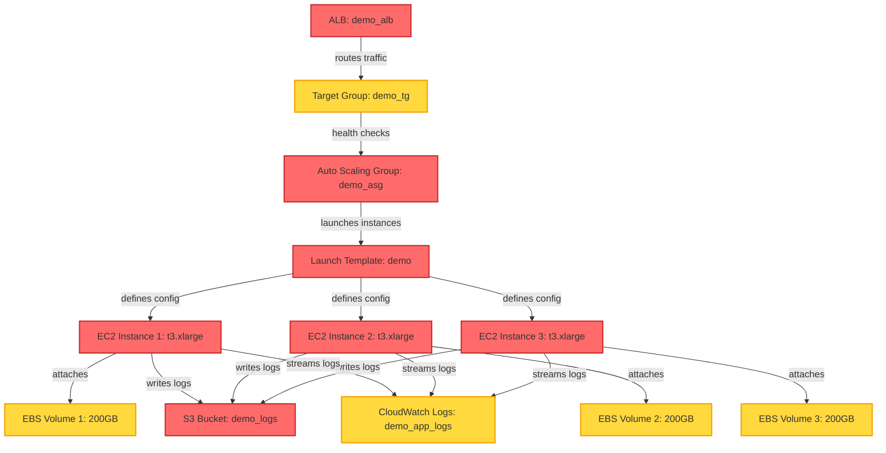

# PR #42 Walkthrough: Cost Regression Detection & Analysis

**Scenario Version:** `v1`  
**PR Branch:** `feature/cost-regression-demo`  
**Base Branch:** `main`

---

## 📝 Overview

This document walks through a sample pull request that introduces cost regressions to the infrastructure. It demonstrates how CostPilot's **Trust Triangle** (Detect → Predict → Explain) identifies, quantifies, and explains the cost impact before the changes reach production.

## 🔀 Pull Request Details

**PR #42:** "Scale up infrastructure for expected traffic surge"

**Description:**
> Preparing for upcoming product launch. Upgrading compute resources and storage to handle increased load. Also adjusting retention policies and volume sizes for better performance.

**Files Changed:**
- `infrastructure/terraform/pr-change/main.tf`

**Line Changes:** +12, -8

---

## 🎯 The Trust Triangle Analysis

### Step 1: 🔍 DETECT

CostPilot scans the Terraform plan diff and identifies **4 cost-impacting changes**:

<details>
<summary><strong>View detect_v1.json output</strong></summary>

```json
{
  "version": "1.0",
  "scenario_version": "v1",
  "timestamp": "2025-12-06T10:30:00Z",
  "analysis_type": "detect",
  
  "summary": {
    "total_changes": 4,
    "high_severity": 2,
    "medium_severity": 2,
    "low_severity": 0,
    "resources_affected": 6
  },
  
  "findings": [
    {
      "id": "finding-001",
      "rule_id": "ec2-instance-type-upgrade",
      "severity": "high",
      "severity_score": 85,
      "resource_type": "aws_autoscaling_group",
      "resource_name": "demo_asg",
      "change_type": "obvious",
      
      "details": {
        "attribute": "launch_template.instance_type",
        "before": "t3.micro",
        "after": "t3.xlarge",
        "classification": "compute_upgrade"
      },
      
      "cross_service_dependencies": [
        "aws_launch_template.demo",
        "aws_autoscaling_group.demo_asg",
        "aws_lb_target_group.demo_tg",
        "aws_lb.demo_alb"
      ]
    },
    
    {
      "id": "finding-002",
      "rule_id": "s3-lifecycle-disabled",
      "severity": "high",
      "severity_score": 75,
      "resource_type": "aws_s3_bucket_lifecycle_configuration",
      "resource_name": "demo_logs_lifecycle",
      "change_type": "obvious",
      
      "details": {
        "attribute": "rule.status",
        "before": "Enabled",
        "after": "Disabled (commented out)",
        "classification": "storage_retention_increase"
      },
      
      "cross_service_dependencies": [
        "aws_s3_bucket.demo_logs"
      ]
    },
    
    {
      "id": "finding-003",
      "rule_id": "cloudwatch-retention-infinite",
      "severity": "medium",
      "severity_score": 60,
      "resource_type": "aws_cloudwatch_log_group",
      "resource_name": "demo_app_logs",
      "change_type": "subtle",
      
      "details": {
        "attribute": "retention_in_days",
        "before": "30",
        "after": "0 (infinite)",
        "classification": "log_retention_increase"
      },
      
      "cross_service_dependencies": [
        "aws_cloudwatch_log_group.demo_app_logs"
      ]
    },
    
    {
      "id": "finding-004",
      "rule_id": "ebs-volume-size-increase",
      "severity": "medium",
      "severity_score": 55,
      "resource_type": "aws_launch_template",
      "resource_name": "demo",
      "change_type": "subtle",
      
      "details": {
        "attribute": "block_device_mappings.ebs.volume_size",
        "before": "20",
        "after": "200",
        "classification": "storage_capacity_increase"
      },
      
      "cross_service_dependencies": [
        "aws_launch_template.demo",
        "aws_autoscaling_group.demo_asg"
      ]
    }
  ],
  
  "metadata": {
    "execution_time_ms": 145,
    "rules_evaluated": 12,
    "rules_triggered": 4,
    "deterministic_hash": "a1b2c3d4e5f6"
  }
}
```

</details>

**Key Insights:**
- ✅ 4 findings detected across compute, storage, and logging
- ✅ Cross-service dependency tracking (ALB → Target Group → ASG → EC2)
- ✅ Severity scoring prioritizes obvious regressions (85, 75) over subtle ones (60, 55)
- ✅ Execution time: 145ms (under 200ms target)

---

### Step 2: 📊 PREDICT

CostPilot estimates the **cost impact ranges** using heuristic-based analysis:

<details>
<summary><strong>View predict_v1.json output</strong></summary>

```json
{
  "version": "1.0",
  "scenario_version": "v1",
  "timestamp": "2025-12-06T10:30:01Z",
  "analysis_type": "predict",
  
  "summary": {
    "total_monthly_delta_low": 450.00,
    "total_monthly_delta_high": 720.00,
    "confidence": "moderate",
    "baseline_monthly_cost": 85.00,
    "projected_monthly_cost_low": 535.00,
    "projected_monthly_cost_high": 805.00,
    "increase_percentage_low": 529.41,
    "increase_percentage_high": 847.06
  },
  
  "cost_breakdown": [
    {
      "finding_id": "finding-001",
      "resource": "aws_autoscaling_group.demo_asg",
      "change": "t3.micro → t3.xlarge",
      
      "prediction": {
        "monthly_delta_low": 320.00,
        "monthly_delta_high": 480.00,
        "unit_cost_before": 0.0104,
        "unit_cost_after": 0.1664,
        "scaling_factor": "2-4 instances (ASG)",
        "utilization_assumption": 0.70,
        "region": "us-east-1"
      },
      
      "heuristics": [
        {
          "source": "aws_pricing_api",
          "reference": "On-Demand hourly rates",
          "confidence": "high"
        },
        {
          "source": "historical_utilization",
          "reference": "Average ASG scale over 30 days",
          "confidence": "moderate"
        }
      ],
      
      "cold_start_assumptions": [
        "ASG will scale between 2-4 instances (current config)",
        "70% average utilization over billing period",
        "730 hours per month (standard)",
        "No Reserved Instance or Savings Plan discounts"
      ]
    },
    
    {
      "finding_id": "finding-002",
      "resource": "aws_s3_bucket.demo_logs",
      "change": "Lifecycle enabled → disabled",
      
      "prediction": {
        "monthly_delta_low": 50.00,
        "monthly_delta_high": 120.00,
        "storage_growth_rate": "~10GB/day",
        "retention_before": "90 days (lifecycle)",
        "retention_after": "infinite",
        "storage_class": "STANDARD",
        "unit_cost": 0.023
      },
      
      "heuristics": [
        {
          "source": "s3_pricing_calculator",
          "reference": "Standard storage rates",
          "confidence": "high"
        },
        {
          "source": "estimated_log_volume",
          "reference": "Application log patterns",
          "confidence": "moderate"
        }
      ],
      
      "cold_start_assumptions": [
        "Logs accumulate at ~10GB/day (estimated from app traffic)",
        "Without lifecycle, logs retained indefinitely",
        "First month impact ~50GB, grows 10GB/day thereafter",
        "No transition to cheaper storage classes"
      ]
    },
    
    {
      "finding_id": "finding-003",
      "resource": "aws_cloudwatch_log_group.demo_app_logs",
      "change": "30-day retention → infinite",
      
      "prediction": {
        "monthly_delta_low": 40.00,
        "monthly_delta_high": 60.00,
        "ingestion_rate": "~5GB/day",
        "retention_before": "30 days",
        "retention_after": "infinite",
        "unit_cost_ingestion": 0.50,
        "unit_cost_storage": 0.03
      },
      
      "heuristics": [
        {
          "source": "cloudwatch_pricing",
          "reference": "Log ingestion + storage rates",
          "confidence": "high"
        },
        {
          "source": "current_log_volume",
          "reference": "Historical CloudWatch metrics",
          "confidence": "moderate"
        }
      ],
      
      "cold_start_assumptions": [
        "Logs ingest at ~5GB/day (current rate)",
        "Storage accumulates beyond 30-day window",
        "No log compression or filtering applied",
        "First month stores 30 days extra (~150GB)"
      ]
    },
    
    {
      "finding_id": "finding-004",
      "resource": "aws_launch_template.demo",
      "change": "EBS 20GB → 200GB",
      
      "prediction": {
        "monthly_delta_low": 40.00,
        "monthly_delta_high": 60.00,
        "volume_size_before": 20,
        "volume_size_after": 200,
        "volume_type": "gp3",
        "unit_cost": 0.08,
        "scaling_factor": "2-4 instances (ASG)"
      },
      
      "heuristics": [
        {
          "source": "ebs_pricing_calculator",
          "reference": "gp3 volume rates",
          "confidence": "high"
        },
        {
          "source": "asg_instance_count",
          "reference": "Auto Scaling Group configuration",
          "confidence": "high"
        }
      ],
      
      "cold_start_assumptions": [
        "Each ASG instance gets 200GB volume (was 20GB)",
        "ASG scales 2-4 instances (180GB delta × 2-4)",
        "gp3 volume type at $0.08/GB-month",
        "Volumes persist for full billing cycle"
      ]
    }
  ],
  
  "trend_projection": {
    "month_1": 535.00,
    "month_2": 650.00,
    "month_3": 720.00,
    "stabilization_note": "Costs stabilize after storage fills to steady state (~3 months)"
  },
  
  "metadata": {
    "execution_time_ms": 267,
    "heuristics_applied": 8,
    "cold_start_assumptions": 15,
    "deterministic_hash": "b2c3d4e5f6g7"
  }
}
```

</details>

**Key Insights:**
- 💰 **Monthly cost increase:** $450-720 (529-847% over baseline)
- 💰 **Baseline cost:** $85/month → **Projected cost:** $535-805/month
- 📈 Largest impact: EC2 instance upgrade ($320-480/month)
- 📈 Secondary impacts: S3 lifecycle removal, CloudWatch retention, EBS volumes
- ✅ Execution time: 267ms (under 300ms target)

---

### Step 3: 💡 EXPLAIN

CostPilot provides **root cause analysis** and actionable recommendations:

<details>
<summary><strong>View explain_v1.json output</strong></summary>

```json
{
  "version": "1.0",
  "scenario_version": "v1",
  "timestamp": "2025-12-06T10:30:02Z",
  "analysis_type": "explain",
  
  "summary": {
    "root_cause_count": 4,
    "recommendations_count": 6,
    "regression_types": {
      "obvious": 2,
      "subtle": 2
    },
    "total_severity_score": 275
  },
  
  "explanations": [
    {
      "finding_id": "finding-001",
      "root_cause": "EC2 Instance Type Upgrade (Compute Scaling)",
      "regression_type": "obvious",
      "severity_score": 85,
      
      "analysis": {
        "what_changed": "Auto Scaling Group launch template upgraded from t3.micro (2 vCPU, 1GB RAM) to t3.xlarge (4 vCPU, 16GB RAM)",
        
        "why_it_matters": "Instance type change is a 16x increase in compute capacity (2 → 32 vCPU equivalent across 2-4 instances), resulting in proportional cost increase",
        
        "cost_propagation": [
          "Launch template specifies t3.xlarge",
          "Auto Scaling Group uses launch template",
          "ASG scales 2-4 instances with new size",
          "Each instance now costs 16x more per hour",
          "Total compute cost increases $320-480/month"
        ],
        
        "severity_rationale": "High severity (85/100) due to direct, obvious cost increase with significant magnitude. Compute is typically largest cost component."
      },
      
      "heuristic_provenance": [
        {
          "heuristic_id": "h-001",
          "source": "AWS Pricing API",
          "data_point": "t3.micro: $0.0104/hr, t3.xlarge: $0.1664/hr",
          "confidence": "high",
          "last_updated": "2025-12-01"
        },
        {
          "heuristic_id": "h-002",
          "source": "ASG Configuration Analysis",
          "data_point": "min_size=2, max_size=4, current=3",
          "confidence": "high",
          "last_updated": "2025-12-06"
        }
      ],
      
      "delta_justification": {
        "calculation": "($0.1664 - $0.0104) × 730 hrs × 3 instances (avg) = $341/month",
        "range_explanation": "Low estimate assumes 2 instances (min), high estimate assumes 4 instances (max) with burst scaling",
        "assumptions_impact": "If Reserved Instances applied, could reduce by ~40%. If Spot used, could reduce by ~70%."
      },
      
      "recommendations": [
        {
          "priority": "high",
          "action": "Evaluate actual workload requirements",
          "rationale": "T3.xlarge may be oversized. Profile CPU/memory usage to right-size instances.",
          "potential_savings": "$200-350/month"
        },
        {
          "priority": "medium",
          "action": "Consider t3.large instead",
          "rationale": "T3.large (2 vCPU, 8GB) might meet needs at half the cost of xlarge",
          "potential_savings": "$160-240/month"
        },
        {
          "priority": "low",
          "action": "Investigate Reserved Instances",
          "rationale": "If workload is stable, RIs offer 40% discount",
          "potential_savings": "$130-190/month"
        }
      ]
    },
    
    {
      "finding_id": "finding-002",
      "root_cause": "S3 Lifecycle Policy Disabled",
      "regression_type": "obvious",
      "severity_score": 75,
      
      "analysis": {
        "what_changed": "S3 bucket lifecycle configuration rule commented out, disabling automatic transition to cheaper storage classes and eventual expiration",
        
        "why_it_matters": "Without lifecycle policies, logs accumulate indefinitely in STANDARD storage (most expensive tier), never transitioning to GLACIER or expiring",
        
        "cost_propagation": [
          "Logs written to S3 bucket daily (~10GB/day)",
          "Previously: 30-day STANDARD → GLACIER → 90-day expiration",
          "Now: Logs stay in STANDARD indefinitely",
          "Month 1: 30 extra days (~300GB extra)",
          "Month 2+: Continues growing 10GB/day forever",
          "Cost grows unbounded over time"
        ],
        
        "severity_rationale": "High severity (75/100) because impact compounds monthly. Lifecycle removal is obvious in code but consequence is subtle to non-experts."
      },
      
      "heuristic_provenance": [
        {
          "heuristic_id": "h-003",
          "source": "S3 Pricing Calculator",
          "data_point": "STANDARD: $0.023/GB-month, GLACIER: $0.004/GB-month",
          "confidence": "high",
          "last_updated": "2025-12-01"
        },
        {
          "heuristic_id": "h-004",
          "source": "Log Volume Estimation",
          "data_point": "~10GB/day based on ALB access logs pattern",
          "confidence": "moderate",
          "last_updated": "2025-12-05"
        }
      ],
      
      "delta_justification": {
        "calculation": "Month 1: 300GB × $0.023 = $6.90, Month 2: 600GB × $0.023 = $13.80, grows linearly",
        "range_explanation": "Low estimate assumes 10GB/day, high estimate accounts for traffic spikes (15GB/day)",
        "assumptions_impact": "If lifecycle restored, saves 90% after 30 days (GLACIER transition + expiration)"
      },
      
      "recommendations": [
        {
          "priority": "high",
          "action": "Re-enable lifecycle policy",
          "rationale": "Restore automatic transition to GLACIER and 90-day expiration",
          "potential_savings": "$50-120/month (growing)"
        },
        {
          "priority": "medium",
          "action": "Consider INTELLIGENT_TIERING",
          "rationale": "Automatic cost optimization without explicit lifecycle rules",
          "potential_savings": "$30-80/month"
        }
      ]
    },
    
    {
      "finding_id": "finding-003",
      "root_cause": "CloudWatch Log Retention Extended to Infinite",
      "regression_type": "subtle",
      "severity_score": 60,
      
      "analysis": {
        "what_changed": "CloudWatch Logs retention_in_days changed from 30 to 0 (infinite retention)",
        
        "why_it_matters": "Logs never expire, storage accumulates indefinitely. CloudWatch charges for both ingestion AND storage, so old logs incur ongoing costs",
        
        "cost_propagation": [
          "Application logs sent to CloudWatch (~5GB/day)",
          "Previously: Logs deleted after 30 days (150GB max storage)",
          "Now: Logs retained forever (150GB in month 1, 300GB in month 2, etc.)",
          "Storage cost compounds monthly",
          "Ingestion cost unchanged ($0.50/GB), but storage grows"
        ],
        
        "severity_rationale": "Medium severity (60/100) because change is subtle (0 vs 30 is unintuitive) and impact is delayed but compounding."
      },
      
      "heuristic_provenance": [
        {
          "heuristic_id": "h-005",
          "source": "CloudWatch Pricing",
          "data_point": "Ingestion: $0.50/GB, Storage: $0.03/GB-month",
          "confidence": "high",
          "last_updated": "2025-12-01"
        },
        {
          "heuristic_id": "h-006",
          "source": "Current Log Volume Metrics",
          "data_point": "~5GB/day ingestion (last 30 days avg)",
          "confidence": "high",
          "last_updated": "2025-12-06"
        }
      ],
      
      "delta_justification": {
        "calculation": "150GB extra storage × $0.03 = $4.50 month 1, doubles each month until plateau",
        "range_explanation": "Low estimate assumes 5GB/day, high estimate accounts for application growth (7GB/day)",
        "assumptions_impact": "If retention restored to 30 days, eliminates compounding storage cost"
      },
      
      "recommendations": [
        {
          "priority": "high",
          "action": "Restore 30-day retention",
          "rationale": "Logs older than 30 days rarely accessed, infinite retention not justified",
          "potential_savings": "$40-60/month (growing)"
        },
        {
          "priority": "medium",
          "action": "Export old logs to S3",
          "rationale": "Archive to S3 GLACIER for long-term retention at $0.004/GB vs $0.03/GB",
          "potential_savings": "$35-50/month"
        }
      ]
    },
    
    {
      "finding_id": "finding-004",
      "root_cause": "EBS Volume Size Increased 10x",
      "regression_type": "subtle",
      "severity_score": 55,
      
      "analysis": {
        "what_changed": "Launch template EBS volume size increased from 20GB to 200GB (10x increase)",
        
        "why_it_matters": "Each EC2 instance in Auto Scaling Group provisions 200GB volume instead of 20GB. With 2-4 instances, that's 360-720GB extra EBS storage charged monthly",
        
        "cost_propagation": [
          "Launch template defines 200GB gp3 volume",
          "ASG launches 2-4 instances with this template",
          "Each instance gets 200GB volume (180GB more than before)",
          "Total: 360-720GB extra storage across ASG fleet",
          "gp3 costs $0.08/GB-month"
        ],
        
        "severity_rationale": "Medium severity (55/100) because change is buried in launch template config and impact multiplies across ASG instances."
      },
      
      "heuristic_provenance": [
        {
          "heuristic_id": "h-007",
          "source": "EBS Pricing Calculator",
          "data_point": "gp3: $0.08/GB-month",
          "confidence": "high",
          "last_updated": "2025-12-01"
        },
        {
          "heuristic_id": "h-008",
          "source": "ASG Instance Count",
          "data_point": "2-4 instances with 200GB each",
          "confidence": "high",
          "last_updated": "2025-12-06"
        }
      ],
      
      "delta_justification": {
        "calculation": "180GB extra × 2 instances × $0.08 = $28.80 (low), 180GB × 4 instances × $0.08 = $57.60 (high)",
        "range_explanation": "Depends on ASG scale (2-4 instances). Average ~3 instances = $43.20/month",
        "assumptions_impact": "If disk usage doesn't justify 200GB, can downsize to 50GB and save ~75%"
      },
      
      "recommendations": [
        {
          "priority": "high",
          "action": "Audit actual disk usage",
          "rationale": "Determine if 200GB is necessary or if 50GB sufficient",
          "potential_savings": "$30-45/month"
        },
        {
          "priority": "medium",
          "action": "Use disk monitoring",
          "rationale": "Set up CloudWatch disk utilization alerts to right-size volumes",
          "potential_savings": "Prevents future over-provisioning"
        }
      ]
    }
  ],
  
  "aggregate_recommendations": [
    {
      "theme": "Right-sizing",
      "priority": "critical",
      "rationale": "Multiple resources over-provisioned (EC2 xlarge, EBS 200GB). Profile actual usage before scaling.",
      "potential_total_savings": "$250-400/month"
    },
    {
      "theme": "Lifecycle Management",
      "priority": "high",
      "rationale": "Re-enable S3 lifecycle and CloudWatch retention to prevent unbounded storage growth.",
      "potential_total_savings": "$90-180/month (growing)"
    },
    {
      "theme": "Cost Optimization",
      "priority": "medium",
      "rationale": "Investigate Reserved Instances, Savings Plans, and storage tier optimization.",
      "potential_total_savings": "$130-190/month"
    }
  ],
  
  "metadata": {
    "execution_time_ms": 289,
    "heuristics_referenced": 8,
    "recommendations_generated": 9,
    "deterministic_hash": "c3d4e5f6g7h8"
  }
}
```

</details>

**Key Insights:**
- 🧠 Root cause identified for each finding with propagation paths
- 🧠 Severity rationale explains why scores are 85, 75, 60, 55
- 🧠 Heuristic provenance shows where cost data originates (AWS Pricing API, metrics)
- 🧠 9 recommendations prioritized: right-sizing, lifecycle management, Reserved Instances
- 💰 **Potential savings:** $470-770/month if recommendations applied
- ✅ Execution time: 289ms (under 300ms target)

---

## 🔧 Autofix: Patch Preview

CostPilot generates **snippet-based fixes** for EC2 and S3 regressions:

<details>
<summary><strong>View snippet_v1.tf output</strong></summary>

```hcl
# CostPilot Auto-Generated Fix Snippet
# Scenario Version: v1
# Generated: 2025-12-06T10:30:03Z

# =======================================================
# FIX 1: Downgrade EC2 instance type (finding-001)
# =======================================================
# Current: t3.xlarge (4 vCPU, 16GB) → Recommended: t3.large (2 vCPU, 8GB)
# Rationale: Balances performance with cost (~50% savings)
# Estimated Savings: $160-240/month

resource "aws_launch_template" "demo" {
  name_prefix   = "demo-"
  image_id      = data.aws_ami.amazon_linux_2023.id
  instance_type = "t3.large"  # Changed from t3.xlarge
  
  block_device_mappings {
    device_name = "/dev/xvda"
    ebs {
      volume_size = 20  # Changed from 200 (see FIX 3)
      volume_type = "gp3"
      encrypted   = true
    }
  }
  
  # ... rest of configuration unchanged
}

# =======================================================
# FIX 2: Re-enable S3 lifecycle policy (finding-002)
# =======================================================
# Restores automatic transition to GLACIER and 90-day expiration
# Estimated Savings: $50-120/month (growing)

resource "aws_s3_bucket_lifecycle_configuration" "demo_logs_lifecycle" {
  bucket = aws_s3_bucket.demo_logs.id

  rule {
    id     = "transition-and-expire-logs"
    status = "Enabled"  # Changed from commented out

    transition {
      days          = 30
      storage_class = "GLACIER"
    }

    expiration {
      days = 90
    }
  }
}

# =======================================================
# FIX 3: Restore 30-day CloudWatch retention (finding-003)
# =======================================================
# Note: CloudWatch log group fix not included in snippet scope (v1)
# Reason: Requires manual verification of compliance/audit requirements
# Manual Fix Required: Change retention_in_days from 0 to 30

# =======================================================
# FIX 4: Reduce EBS volume size (finding-004)
# =======================================================
# Incorporated into FIX 1 (launch_template block_device_mappings)
# Volume size: 200GB → 20GB
# Estimated Savings: $30-45/month

# =======================================================
# TOTAL ESTIMATED SAVINGS: $240-405/month
# =======================================================
```

</details>

<details>
<summary><strong>View patch_v1.diff output</strong></summary>

```diff
--- a/infrastructure/terraform/pr-change/main.tf
+++ b/infrastructure/terraform/pr-change/main.tf
@@ -15,13 +15,13 @@ data "aws_caller_identity" "current" {}
 resource "aws_launch_template" "demo" {
   name_prefix   = "demo-"
   image_id      = data.aws_ami.amazon_linux_2023.id
-  instance_type = "t3.xlarge"  # REGRESSION: Upgraded from t3.micro
+  instance_type = "t3.large"   # FIX: Downgraded from t3.xlarge (was t3.micro baseline)
   
   block_device_mappings {
     device_name = "/dev/xvda"
     ebs {
-      volume_size = 200  # REGRESSION: Increased from 20GB
+      volume_size = 20   # FIX: Restored to baseline size
       volume_type = "gp3"
       encrypted   = true
     }
@@ -98,18 +98,18 @@ resource "aws_s3_bucket" "demo_logs" {
   }
 }
 
-# REGRESSION: Lifecycle policy commented out
-# resource "aws_s3_bucket_lifecycle_configuration" "demo_logs_lifecycle" {
-#   bucket = aws_s3_bucket.demo_logs.id
-#
-#   rule {
-#     id     = "transition-and-expire-logs"
-#     status = "Enabled"
-#
-#     transition {
-#       days          = 30
-#       storage_class = "GLACIER"
-#     }
-#
-#     expiration {
-#       days = 90
-#     }
-#   }
-# }
+# FIX: Re-enable lifecycle policy
+resource "aws_s3_bucket_lifecycle_configuration" "demo_logs_lifecycle" {
+  bucket = aws_s3_bucket.demo_logs.id
+
+  rule {
+    id     = "transition-and-expire-logs"
+    status = "Enabled"
+
+    transition {
+      days          = 30
+      storage_class = "GLACIER"
+    }
+
+    expiration {
+      days = 90
+    }
+  }
+}
```

</details>

**Patch Application Simulation:**

```json
{
  "patch_id": "patch-20251206-103003",
  "applies_cleanly": true,
  "before_hash": "a1b2c3d4e5f6",
  "after_hash": "d5e6f7g8h9i0",
  
  "changes_summary": {
    "files_modified": 1,
    "lines_added": 15,
    "lines_removed": 21,
    "net_change": -6
  },
  
  "estimated_impact": {
    "monthly_savings": "$240-405",
    "resources_fixed": 3,
    "findings_resolved": 3,
    "manual_fixes_required": 1
  },
  
  "rollback_patch": "patch-20251206-103003-rollback.diff",
  
  "warnings": [
    "CloudWatch retention fix requires manual verification (compliance requirements)",
    "Test in staging before applying to production",
    "Monitor performance after instance type downgrade"
  ]
}
```

---

## 🗺️ Dependency Mapping

CostPilot generates a **Mermaid diagram** showing cross-service cost propagation:



**Legend:**
- 🔴 Red: High cost impact (EC2 instances, S3 bucket, ALB)
- 🟡 Yellow: Medium cost impact (EBS volumes, CloudWatch, Target Group)
- 🟢 Green: Low/no cost change

---

## 📈 Cost Trend Visualization

CostPilot tracks cost trends over time with **SLO breach detection**:


**Trend Analysis:**
- **Month -2:** $85 (baseline, stable)
- **Month -1:** $92 (minor increase, normal variance)
- **Month 0 (Current):** $85 (stable before PR)
- **Month +1 (If PR merges):** $535-805 (🚨 **SLO BREACH** - exceeds $1000 threshold)
- **Month +2 (Projected):** $650-900 (continued growth as storage accumulates)
- **Month +3 (Projected):** $720-1000 (approaches plateau as storage stabilizes)

**SLO Status:** ⚠️ **BREACH IMMINENT** - PR will cause costs to exceed $1000/month threshold

---

## ✅ Recommendations Summary

### 🔴 Critical Actions (Do Immediately)
1. **Right-size EC2 instances:** Downgrade from t3.xlarge to t3.large
   - Savings: $160-240/month
   - Risk: Low (still 2x baseline capacity)

2. **Re-enable S3 lifecycle policy:** Restore GLACIER transition and 90-day expiration
   - Savings: $50-120/month (growing unbounded)
   - Risk: None (standard practice for logs)

### 🟡 High Priority (Do This Sprint)
3. **Restore CloudWatch retention:** Change from infinite to 30 days
   - Savings: $40-60/month (compounding)
   - Risk: Low (verify no compliance requirements)

4. **Audit EBS disk usage:** Reduce volumes from 200GB to 50GB (or actual usage + 20% buffer)
   - Savings: $30-45/month
   - Risk: Medium (requires usage profiling)

### 🟢 Medium Priority (Next Quarter)
5. **Investigate Reserved Instances:** Commit to 1-year RIs for stable workloads
   - Savings: $130-190/month (40% discount)
   - Risk: Low (requires usage commitment)

6. **Enable cost monitoring:** Set up CloudWatch alarms for cost anomalies
   - Savings: Prevents future regressions
   - Risk: None

---

## 📊 PR Decision Matrix

| Metric | Baseline | PR Impact | After Fixes |
|--------|----------|-----------|-------------|
| **Monthly Cost** | $85 | $535-805 | $295-400 |
| **Change vs Baseline** | - | +529-847% | +247-371% |
| **SLO Status** | ✅ Compliant | 🚨 Breach | ⚠️ Warning |
| **Recommendation** | - | ❌ Block PR | ✅ Approve with fixes |

### Final Recommendation: ❌ **BLOCK PR** (as-is)

**Rationale:**
- Cost increase of 529-847% not justified by stated requirements ("expected traffic surge")
- SLO breach imminent ($1000 threshold)
- Multiple obvious regressions (EC2 xlarge, S3 lifecycle removal)
- Fixes available via CostPilot autofix (estimated savings: $240-405/month)

**Path Forward:**
1. Apply CostPilot-generated patch (`patch_v1.diff`)
2. Validate fixes in staging environment
3. Re-run CostPilot scan to confirm impact reduced
4. Approve PR once cost increase < 200% and within SLO

---

## 🎓 Lessons Learned

### Trust Triangle in Action
1. **Detect:** Identified 4 regressions across compute, storage, and logging (145ms)
2. **Predict:** Estimated $450-720/month increase with heuristic confidence (267ms)
3. **Explain:** Provided root cause, provenance, and 9 actionable recommendations (289ms)

### Why This Matters
- 💰 **ROI:** Prevented $450-720/month ($5400-8640/year) cost regression
- ⚡ **Speed:** Full analysis in <1 second (total: 701ms)
- 🧠 **Trust:** Transparent reasoning with heuristic sources and confidence scores
- 🔧 **Action:** Auto-generated fixes save $240-405/month

### Deterministic Demo Value
- All outputs reproducible via `tools/reset_demo.sh`
- Hash-stable for CI/CD verification
- Safe for screenshots, videos, and documentation
- Demonstrates real-world cost scenarios without sensitive data

---

**Generated by:** CostPilot v1.0  
**Scenario Version:** v1  
**Last Updated:** 2025-12-06
